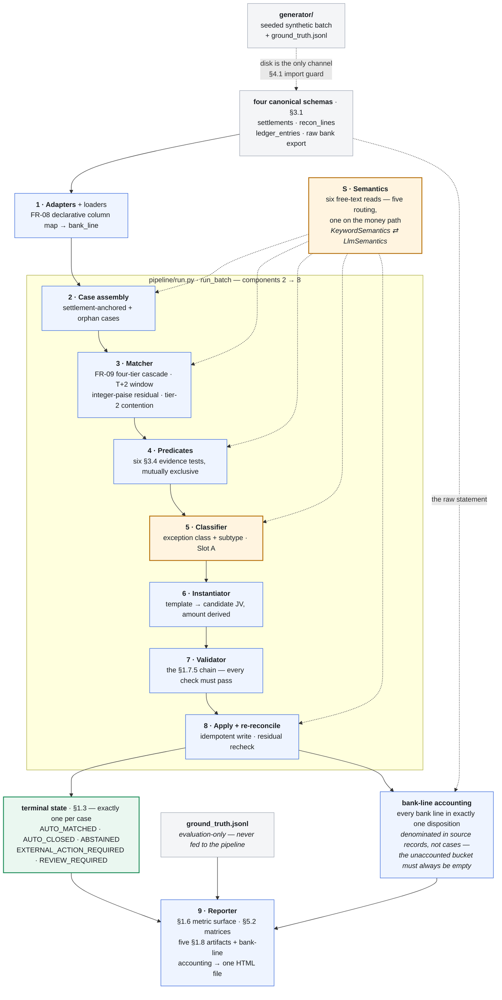
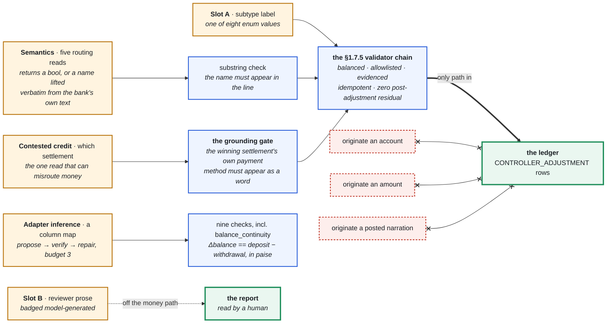

# AI Settlement Close Controller

Razorpay AI Buildathon 2026, Track 4 (AI Finance Controller). Solo build. `spec.md` is the single source of truth — every claim below traces to a section of it, and every number is read off a committed artifact, not typed from memory.

## The one-paragraph version

An agent that ingests a merchant's accounting-ledger export, Razorpay Settlement Reconciliation data, and the merchant's bank statement, and closes the settlement accounting loop across a 150-case batch. **80 of 150 cases close fully automatically — 100% of the population ground truth marks automatable — with `false_match_rate` 0/150 and `auto_close_precision` 50/50.** The remaining 70 are categorized, evidenced, and handed to a human with the external action named. Everything that reaches the ledger is computed by deterministic code; the model is used in exactly the places where a deterministic answer does not exist, and the repository measures what it is worth in both directions.

## What this is

For each reconciliation case, the Controller:

1. Matches high-confidence records across the three sources (FR-09's four-tier cascade).
2. Detects accounting discrepancies — unposted refunds, fee/GST mismatches, chargeback lifecycle events, settlement holds, timing differences — and derives a correcting journal entry from a **fixed allowlist of six templates** (§3.4), never an invented account or amount (invariant 1.7.2).
3. Validates every candidate against the full §1.7.5 chain (balance, allowlist membership, evidence, idempotency, zero post-adjustment residual) before it is allowed to post.
4. Applies validated corrections to a synthetic ledger and re-reconciles to confirm the discrepancy actually closed.
5. Categorizes operational exceptions it cannot resolve itself and names the external action required.
6. Abstains, explicitly, when evidence does not justify an automated decision — abstention is a designed outcome (§1.3), not a failure.

Every case terminates in exactly one of five states: `AUTO_MATCHED`, `AUTO_CLOSED`, `EXTERNAL_ACTION_REQUIRED`, `REVIEW_REQUIRED`, `ABSTAINED` (§1.3).

### The shape of the system

Ten components (§4.1), one direction of data flow, no cycles. Two things the component table further down cannot show: the generator reaches the pipeline **only through disk** (§4.1's import guard makes any other channel a test failure), and **component S is not a stage** — it is a dependency components 2, 3, 4, 5 and 8 each take, threaded as a `semantics=` parameter, which is why it hangs off the spine rather than sitting on it.



<sub>**Blue** deterministic · **amber** has a model-touching arm, each separately switchable and separately measured · **grey** data · dotted edges are dependencies, not data flow.</sub>

### Where the model is allowed to act, exactly

Invariant 1.7.2: the model may *classify* and may *write prose*; it may never originate an account, an amount, or a narration on the automated path. Everything that reaches the ledger — which account, which amount, which template — is computed by deterministic code the model never touches. There are five model-touching surfaces, and each is separately switchable and separately measured:

| surface | module | what it decides | graded |
|---|---|---|---|
| **Semantics** — five free-text reads over bank and adjustment prose | `pipeline/semantics.py` | does this narration name a counterparty; is this credit the gateway; is this a reversal; is this a bank charge; is this a tax position | yes — the whole §1.6 surface, both arms |
| **Slot A** — exception-subtype classification | `pipeline/classifier.py` | one of eight subtype labels on a non-auto-close case | yes — §5.2 |
| **Slot B** — resolution text and abstention rationale | `pipeline/narration.py` | prose for a human reviewer, labelled model-generated in the report | no — off the money path |
| **Contested-credit resolution** — the money-path read | `pipeline/semantics.py` | which of two settlements a contested credit pays, or `null` | yes — `false_match_rate` is the referee |
| **Adapter inference** — the agentic loop | `pipeline/adapters/inference.py` | a proposed YAML column map for a bank with no hand-written profile | yes — nine deterministic checks accept or reject it |

Drawn, because this is the invariant the whole build rests on — five model surfaces, every one of them routed through deterministic code that already existed, and three things with no path to the ledger at all:



The semantics surface returns only a `bool` or a counterparty name **lifted verbatim out of text the bank wrote** (verified as a substring before it is trusted). Its answers route cases; they never price one. `LlmSemantics` could return adversarial nonsense on every call without producing a wrong journal entry — it would produce wrong routing, which the §1.6 metric surface measures and the §1.7.5 validator chain still gates.

## The headline result: where the model earns its place, and where it does not

The reference batch grades **1.0000 on everything** with no model involved. That is not a result — it is a finding about the batch, and chasing it down is the most useful thing this build did.

Five of the pipeline's decision boundaries were literal-substring tests, and each separated the generator's corresponding string pool with 100% hit and 0% miss. §4.1's import guard cannot see that (a shared *vocabulary* is not an import) and a seed sweep cannot see it (a seed does not vary a module constant). So `data/heldout_vocab/` was built: **the same 150 cases, the same injected anomalies, the same `ground_truth.jsonl` copied byte-for-byte — only the bank's wording changed**, to real Indian bank-statement vocabulary sharing no literal with those lists. `RZRPAY SOFTWARE PVT LTD` for the gateway. `SUSPENSE-CR` for an opaque credit. `Withholding deduction, marketplace facilitator remittance` for the 194-O exclusion.

| batch | `--semantics keyword` | `--semantics llm` |
|---|---|---|
| `data/reference/` — 150 cases | 150/150 state, macro P/R **1.0000** | 150/150 state, macro P/R **1.0000** |
| `data/heldout_vocab/` — same cases, same answer key, different words | **cannot complete a run** | 150/150 state, macro P/R **1.0000**, all seven subtypes |

`false_match_rate` is 0/150 and `auto_close_precision` 50/50 on both arms of both batches.

On the batch this repository has always shipped, the model earns nothing and is correctly **not** the default. Change only the words, and the keyword arm does not degrade gracefully — it raises `MetricsError: ground-truth case 'orphan_53fdba0a' matches no assembled case`, because `GATEWAY_MARKER` stops separating the gateway from a merchant and the 125/25 case split collapses into 243 assembled cases — while the model arm recovers the batch completely.

Both rows reproduce offline from the committed cache, with no API key:

```bash
uv run reconcile --semantics llm --data-dir data/heldout_vocab --cache-path data/semantics_cache.json
uv run reconcile --semantics keyword --data-dir data/heldout_vocab   # raises, by design
```

The LLM row is also a committed artifact — `data/heldout_vocab/metrics.json` and `report.html`, pinned the same way FR-13 pins the reference run — so a reviewer who never runs the code still sees it. And `tests/test_heldout_vocabulary.py` pins **both** rows, asserting the failure as hard as the success: if someone later widens `GATEWAY_MARKER` to cover `RZRPAY`, the keyword arm starts completing this batch, that test goes red, and the ablation has to be re-measured rather than silently becoming a comparison of two arms that now agree. It also asserts `LlmSemantics.misses == 0`, so the headline number cannot be produced by a run that quietly fell back to keywords, and that `ground_truth.jsonl` is byte-identical to the reference batch's, so the comparison stays fair.

## The second result: judgment on the money path, and the gate it needs

The vocabulary ablation above is about *robustness* — the model reading words the rules were not written for. This one is about *judgment*, and it is the only place in the build where the model can change a money outcome.

**It started as a bug.** FR-09 tier 2 matches a credit to a settlement by exact amount inside a T+2 window, and that key is not unique to a settlement. `match_settlement_anchored_case` enforced §4.6's "a tie is not a match" *within* one settlement's candidates — the only tie a per-case pass can see. Across settlements, nothing checked:

```
setl_AAA  tier=2  residual=0  lines=['bank_X']
setl_BBB  tier=2  residual=0  lines=['bank_X']     -> DOUBLE CLAIM
```

Both reach `AUTO_MATCHED` on one credit that can belong to at most one of them — a guaranteed false match against §1.6's primary safety metric. It survived 602 tests and six seeds because `generator/clean.py` draws amounts lognormally, so an exact collision inside one window essentially never occurs. `match_cases` now demotes every claimant to tier 3, and abstaining on both is *correct*, not merely safe: the evidence genuinely does not say which settlement owns the credit.

**Then it became the experiment.** A contested credit is the first place the deterministic path abstains not from caution but because no rule in §4.6 *can* express the discriminator — while a human reads it in seconds. `data/contested/` is twelve hand-authored cases: two pairs whose narration names the payment method the settlement actually settles, two pairs whose narration says nothing, and four uncontested controls.

| arm | state accuracy | contests resolved | bank credit left unattached | `false_match_rate` |
|---|---|---|---|---|
| `--semantics keyword` | 6/12 = 0.5000 | 0 of 2 | Rs 12,693.20 (4 credits) | **0/12** |
| `--semantics llm` | 8/12 = 0.6667 | 2 of 2 | Rs 5,370.20 (2 credits) | **0/12** |

The model arm is strictly additive — it matched everything the keyword arm did — and the two it gains are exactly the decidable contests.

**The fourth column is the result restated in the unit that matters.** Two cases is a thin number to hang a claim on. The same result denominated in money is that the grounded read returns **Rs 7,323.00 of real bank credit to a settlement** that the deterministic arm leaves attached to nothing — and the credits it still cannot place are a strict subset of the ones the keyword arm cannot. `tests/test_bank_accounting.py` asserts both the subset relation and the rupee figure, and that resolving a contest moves money between dispositions without creating or destroying any.

**The part worth reading is what happened before the gate existed.** Measured first, on a narration that names nothing (`"NEFT CR RAZORPAY SOFTWARE PVT LTD SETTLEMENT"`), the model answered a settlement id anyway. 5 of 6. A coin flip presented as an answer — and on this read a coin flip books a real credit against the wrong settlement.

The fix is not a better prompt. It is to stop trusting the answer and check the **justification**: a settlement may only win if one of its own payment methods appears as a word in the narration the model read — the same shape of check as the counterparty read's substring rule, and unfakeable for the same reason. The model may point at evidence; it may not assert without it. An ungrounded answer is discarded rather than downgraded, so it costs exactly the abstention the deterministic path would have produced. **With the gate, 6 of 6**, and the four undecidable settlements stay untouched.

That is this repository's answer to the track's *"verification capacity, not generation speed, is the bottleneck"* — not quoted, measured. `tests/test_contested.py` pins both arms, including that the model arm is strictly additive and costs no false match.

## Non-goals

Explicitly out of scope (§2.10):

- Not a general reconciliation or rules-based bookkeeping product — Razorpay already ships those (Settlement Reconciliation API, Razorpay Recon, the Bookkeeping Agent). This build is the exception-resolution layer *above* predefined rules: the cases where merchant ledger, settlement data, and bank statement disagree in ways a rule can't resolve.
- No web server, SPA, database UI, authentication, or live dashboard. The CLI is the product (FR-10); the report is one static HTML file (FR-11).
- No real merchant data, anywhere. Every record comes from one seeded synthetic generator (`generator/`), which the graded pipeline (`pipeline/`) is structurally forbidden from importing (§4.1's import guard, `tests/test_import_guard.py`).
- No FR-05 (recognition-entry proposals on `EXTERNAL_ACTION_REQUIRED` cases) in v1 — §2.4's stated fallback, unbuilt by design.

## Required disclosures

Two facts the spec requires stated everywhere the numbers below are shown — here, in the FR-11 report header, and in the pitch video (§3.5, §5.3):

> **Synthetic evaluation.** Ground-truth labels and the records being graded come from one generator. The evaluation measures whether the pipeline recovers the injected intent; it does not establish that the injected intent resembles a real merchant's books.

> **Anomaly enrichment.** `match_rate` on this batch is not comparable to any industry figure. The batch is deliberately anomaly-enriched for metric legibility — only 30 of 150 cases (20%) require no action at all, against a real-world break rate closer to low single digits, roughly an order of magnitude enrichment. `EXTERNAL_ACTION_REQUIRED` runs high because orphan cases are unresolvable by construction (§3.6) and are the majority of that state's population: 36 of 150 cases (24.0%) are ground-truth `EXTERNAL_ACTION_REQUIRED`.

## Quickstart / reproduce path

```bash
uv sync
uv run reconcile
```

That single command (FR-10) reads the committed reference batch at `data/reference/` (seed 0, snapshot 2026-08-28), runs the full pipeline, and writes a console summary plus `.run/report.html` and `.run/metrics.json`.

Defaults: `--semantics keyword`, `--classifier baseline` (the arms that measure best on this batch — see the ablations), `--cache-mode strict` (no network call is ever made; `--cache-mode refresh` is the only mode that calls Fireworks, and needs `FIREWORKS_API_KEY`). Every arm runs offline against the committed caches.

To reproduce the **exact pinned run** (FR-13) in place:

```bash
uv run reconcile --seed 0 --git-sha <sha from data/metrics.json> --out-dir data
```

`tests/test_reproduce.py` runs this for real — a genuine `git clone --local` into a temp directory, a genuine `uv sync`, a genuine `uv run reconcile` with `FIREWORKS_API_KEY` stripped from the subprocess environment — and asserts the resulting `metrics.json` is byte-identical to the one committed at `data/metrics.json` (NFR-01, NFR-06).

Other entry points:

```bash
uv run generate --seed 0 --out-dir data/reference          # regenerate the reference batch
uv run python tools/build_heldout_vocab_batch.py data/reference data/heldout_vocab
uv run python tools/infer_bank_profile.py data/unseen_bank/kotak_statement.csv
uv run pytest                                               # 611 passed, 1 skipped
```

## The agentic surface: bank-profile inference

FR-08's adapter reads a bank export through a declarative YAML column map. Three are hand-written (`hdfc`, `icici`, `axis`). For a bank with no profile, `pipeline/adapters/inference.py` runs a bounded **propose → verify → repair** loop:

1. **Propose.** The model sees the header row and sample rows and returns a column map under constrained decoding. Its output space is column names and a `strftime` pattern — the schema has no field for an amount or an account.
2. **Verify.** Nine deterministic checks run the real, unmodified `parse_bank_statement` over the real file. The strongest is `balance_continuity`: `balance[i] − balance[i−1] == deposit[i] − withdrawal[i]` in integer paise, which uses the statement's own running balance as an independent witness against a debit/credit swap.
3. **Repair.** The failing check's exact text feeds the next prompt. Each attempt is a distinct prompt, so the whole multi-attempt run replays offline from `data/adapter_cache.json`.
4. **Terminate.** Three attempts, then a clean give-up — never an exception.

Every iteration is judged by deterministic code that already existed, which is why the loop cannot violate invariant 1.7.2 or reach the money path.

**Measured.** `data/unseen_bank/kotak_statement.csv` — a six-row junk header block, a serial column, `DD/MM/YYYY` dates, comma-grouped amounts, separate `Withdrawal (Dr)`/`Deposit (Cr)` columns — is **accepted on attempt 1**: 12/12 rows parsed, withdrawal and deposit totals equal to the statement's own printed summary block, so the parse is right rather than merely successful.

**A measured negative, kept as a test.** `data/unseen_bank/yesbank_statement.csv` has one `Amount (INR)` column plus a separate `Dr/Cr` flag. FR-08's profile schema has two money columns and no direction flag, so **no column map can express this file**. The model read the date shape correctly, `direction_coherent` rejected the mapping, the repair prompt did not converge across attempts 2 and 3 because there is nothing to converge to, and the loop gave up cleanly at the budget with no profile written. That is a schema limitation, not a model failure, and it is reported as one.

## Batch and datasets

| dataset | what it is |
|---|---|
| `data/reference/` | The committed seed-0 batch (FR-12): 150 cases — 125 settlement-anchored, 25 orphan — 1,392 recon lines, 5,418 ledger entries, 176 bank lines. Every population's size is fixed by §3.5/§3.6's allocation tables and asserted exactly in `tests/test_generator_batch.py`. |
| `data/heldout_vocab/` | The same batch under a disjoint surface vocabulary (`tools/heldout_vocabulary.py`). Rewritten by template, `{ref}` tokens preserved verbatim so FR-09's tier cascade sees identical tokens; `ground_truth.jsonl` copied byte-for-byte. |
| `data/contested/` | Twelve hand-authored cases exercising FR-09 tier-2 contention: two decidable pairs, two undecidable pairs, four uncontested controls. Reported separately (`tests/test_contested.py`), never merged. |
| `data/adversarial/` | Ten hand-authored cases, no RNG, targeting four evidence boundaries: `T-01` vs `T-03` (REV-16), the family-4 timing triangle, duplicate-credit vs reversal (REV-18), and the ambiguous / unmatched-inbound-credit split. Reported separately (`tests/test_adversarial.py`), never merged: 10/10 state and exception-class agreement. |
| `data/unseen_bank/` | Two bank exports with no hand-written profile, for the inference loop above. |
| seed 2 (generated on demand) | §5.1's held-out batch, never inspected case by case. |

Ground truth is emitted from the injection plan when each case is planted, never re-derived by inspecting the generated records (§3.5) — re-deriving would embed the pipeline's own matching logic into its answer key.

## Metrics and evaluation

The full §1.6 metric surface is computed against ground truth in `pipeline/metrics.py`. Every rate carries its own integer numerator and denominator (never a bare float), and an undefined metric reports as `undefined`, never as `0.0`. A macro average is a `MacroRate`, not a `Rate` — a mean of ratios is not a ratio, and expressing it as one produced a committed artifact that read `{"numerator": 7, "denominator": 7, "value": 0.80}`. Two §5.2 confusion matrices, a per-subtype breakdown, and the §5.5 threshold review are in `pipeline/eval_report.py`; all five §1.8 artifacts render into one self-contained HTML file (`pipeline/report.py`, FR-11), alongside a sixth section §1.8 does not ask for — see **bank-line accounting** below.

### Bank-line accounting: the one figure denominated in source records

Every §1.6 metric is denominated in **cases**. That is the right unit for grading, and it has one blind spot: a bank line that reaches no case is invisible to all of them. `data/contested/` shipped that way — Rs 12,693.20 of real bank credit in no case, no metric and no report. Four credits narrate the gateway, so `assemble_orphan_cases` never considered them; FR-09 tier-2 demotion then dropped them from every settlement that had claimed them. Every individual decision was correct and safe. The batch simply stopped adding up, and **no test could see it**, because there was no metric in the unit the loss occurred in.

`pipeline/bank_accounting.py` closes that. It is not a §1.6 metric and grades nothing against ground truth — it is a **partition proof**. Every bank line lands in exactly one disposition, and `unaccounted` is the bucket that must always be empty:

| disposition | reference batch | what it means |
|---|---|---|
| `settlement_evidence` | 98 lines, Rs 20,68,915.10 | matched to a settlement by FR-09's cascade |
| `orphan_evidence` | 28 lines, Rs 37,634.69 | evidence on an orphan case (§1.2, §3.6) |
| `contested_unawarded` | 0 | claimed by 2+ settlements at tier 2, awarded to none (§4.6) |
| `bank_charge` | 20 lines | §3.6: bank charges stay noise, not cases |
| `self_matched_reversal` | 12 lines, Rs 6,724.03 | a credit and its own reversal netting to a wash (REV-18) |
| `outbound_noise` | 18 lines | an ordinary debit to an unrelated party |
| **`unaccounted`** | **0** | **reachable by no rule — a defect, and the assertion that matters** |

176 lines in, 176 placed. It renders as section 6 of the FR-11 report, ships in `metrics.json`, and `tests/test_bank_accounting.py` asserts the partition is total on all four committed batches. The dispositions are read off the pipeline's own decisions — `is_reversal_shaped`, `find_self_matching_reversal_pairs` and the semantics surface are imported from the modules that made the call, never re-derived, because a drifted second copy would report a clean partition over a batch that no longer has one.

**What it is honest about.** It does not resolve a contested credit; it makes one impossible to lose. A non-zero `contested_unawarded` is the correct outcome of genuinely ambiguous evidence, not a bug — but it is now a rupee figure a reviewer can act on rather than an absence nobody can see.

**Measured at seed 0, the shipped arms (`--semantics keyword --classifier baseline`), nothing tuned in response to it:**

| Metric | Value | §5.5 target |
|---|---|---|
| `false_match_rate` | 0/150 = 0.0000 | 0 |
| `auto_close_precision` | 50/50 = 1.0000 | ≥ 0.98 |
| `auto_match_precision` | 30/30 = 1.0000 | ≥ 0.95 |
| `auto_close_recall` | 50/50 = 1.0000 | 0.80 – 0.95 |
| `auto_match_recall` | 30/30 = 1.0000 | 0.85 – 0.95 |
| `state_prediction_accuracy` | 150/150 = 1.0000 | 0.80 – 0.90 |
| `exception_subtype_recall` (macro, 7 subtypes) | 1.0000 | 0.70 – 0.85 |
| `exception_subtype_precision` (macro, 7 subtypes) | 1.0000 | 0.75 – 0.90 |
| `abstention_rate` | 17/150 = 0.1133 | 8 – 18% |
| `declined_by_policy_rate` | 17/150 = 0.1133 | ≈ 11.3% |
| `value_coverage` | 0.6246 | reported, no target |

**Read the perfect scores as a statement about the batch, not the system.** Every 1.0000 is real and reproducible, and none of it is evidence the Controller is good — see the saturation note below. The numbers worth reading as results are `false_match_rate` (0, on a batch built to tempt false matches) and **80 of 150 cases closing fully automatically, which is 100% of the population ground truth marks automatable.** `match_rate` (30/150 = 0.20) counts only the no-adjustment half of that and is the §1.6 name for it, so it is reported under that name and not as a headline.

**The benchmark is saturated, and that is a finding about the batch.** The keyword arm scores 1.0000 on state accuracy and both macro subtype metrics at seeds 0, 1, 2, 5, 7 and 11, and the adversarial set is 10/10. This generator plants *structurally unambiguous* anomalies — each family produces a distinct arithmetic signature, and REV-16 made the six template predicates mutually exclusive by construction, so evidence → label is a bijection with no irreducible ambiguity for judgment to resolve. A perfect score on a task where perfection is arithmetic proves as little as one cherry-picked match. `data/heldout_vocab/` is the batch built to say something the reference batch cannot.

**§5.4 ablation — the Slot A classifier arms, `exception_subtype` macro, seed 0, reference batch:**

| arm | macro precision | macro recall | state accuracy | LLM calls |
|---|---|---|---|---|
| `baseline` — triggers + keyword read | **1.0000** | **1.0000** | **150/150** | 0 |
| `hybrid` — triggers win; Slot A decides only the untriggered orphan split | 0.9333 | 1.0000 | 143/150 | 16 |
| `llm` — Slot A over all eight labels | 0.8012 | 0.8405 | 143/150 | 70 |

Held-out (seed 2) reproduces the ordering: `llm` −0.2044 precision / −0.1143 recall against `baseline`; `hybrid` −0.0612 / ±0.0000.

**Why Slot A loses, stated plainly.** Six of the seven graded subtypes have a deterministic §3.3 trigger, and `EvidenceBundle` — correctly, per invariant 1.7.2 — carries no UTR, no amount and no dispute flag. So the model cannot *check* six of the eight definitions it is asked to choose between; it pattern-matches narration text instead. The cost lands as false positives on cases whose ground truth is `ABSTAINED`: confident operational exceptions manufactured out of genuine ambiguity, which is the error direction §1.3 ranks worst. `hybrid` recovers all of the lost recall and most of the precision by scoping the model to the one split §4.2 actually reserves for it. Slot A stays in the repository as the §5.4 comparator and as the honest record of a measured negative result.

Note the contrast with the semantics ablation above, which is the actual lesson: **the same model is net-negative when asked to choose among labels it cannot verify, and decisive when asked a question it can.**

**Development-versus-held-out gap (§5.1, seed 1 vs seed 2), Slot A arm:** the largest gap on a §5.5-targeted metric is `state_prediction_accuracy`, −0.0133 (two cases in 150), and every targeted gap is negative or zero. `false_match_rate` and `auto_close_precision` stay perfect on both batches. On the deterministic arm every §5.5-targeted metric has a gap of exactly zero, as §5.1 predicts for a path with no learned parameters.

**MEASURED, NOT TUNED — with one disclosed exception.** No §5.5 threshold, predicate, or classifier behaviour has been changed in response to any figure in this README or the committed reports. The one exception, recorded here and in the code: `_REVERSAL_INSTRUCTIONS` in `pipeline/semantics.py` was revised once after measurement, because the first version answered `false` for two `NEFT RTN <ref> <party>` lines whose shape it had already accepted elsewhere. Naming the abbreviation vocabulary in the prompt is the same move the keyword arm makes with `REVERSAL_KEYWORDS`, at the level of a concept rather than a batch's literals. It was written against `data/heldout_vocab/`, a development artifact — not §5.1's held-out seed-2 batch.

**Performance (FR-02, NFR-02, NFR-03), on `Windows AMD64, Intel64 Family 6 Model 154 Stepping 4, Python 3.11.15`, three runs each:** reference batch (150 cases, 7,111 raw records) 685–795 cases/s; scale batch (seed 3, 362 cases, 19,355 raw records) 368–383 cases/s. Re-measured after the `semantics` refactor — the indirection cost nothing, and both figures came in above the pre-refactor measurement (605–656 and 299–310), which is machine variance rather than an optimisation and is reported as the current range rather than the better one. Reproduce with `uv run python tools/measure_performance.py`.

## What broke, and how it was recovered

`FAILURES.md` is the record: ten incidents with what broke, how it was found, the root cause, and the guard that stops it recurring — including a `UNIQUE` constraint that made `AUTO_CLOSED` unreachable for all 50 cases, nine ground-truth labels no component could ever reach, the adversarial review that found this repository shipping, pinning and documenting the arm that measures worst, and **Rs 12,693.20 of bank credit that went missing without moving a single metric**, because every rate in §1.6 is denominated in cases and the loss happened in source records.

## Repository layout

Root holds four documents and nothing else, in the order a reader needs them: what I said I would build, what I built, how it is put together, and what broke. The two working documents that drove the build — the standing brief and the session log — are evidence rather than reading material, so they sit in `docs/`.

```
AI Settlement Close Controller/
├── spec.md                     # what I said I'd build — single source of truth
├── README.md                   # what I built, and what it measures
├── ARCHITECTURE.md             # how it's put together — component-level design notes
├── FAILURES.md                 # what broke and how it was recovered
├── docs/
│   ├── AGENT.md                #   standing brief every coding session opens with (§6.1)
│   └── BUILDLOG.md             #   append-only, one entry per session (Built/Broke/Cut/Decided/Next) (§6.2)
├── generator/                  # synthetic data + ground truth — separate entry point
├── pipeline/                   # the graded path — MUST NOT import generator/, ever
│   ├── cli.py                  #   `uv run reconcile` — FR-10's single command
│   ├── run.py                  #   components 2-8, composed end to end
│   ├── semantics.py            #   the six free-text reads, keyword and LLM arms
│   ├── bank_accounting.py      #   where every bank line went — the partition proof
│   ├── adapters/inference.py   #   FR-08 profile inference: propose -> verify -> repair
│   ├── metrics.py / eval_report.py / report.py    # component 9 (§1.6, §5.2, FR-11)
│   └── ...                     #   matcher, predicates, instantiator, validator, apply, classifier, narration
├── tools/                      # capability-bearing scripts (FR-12 keeps these in-repo)
│   ├── heldout_vocabulary.py   #   the disjoint surface vocabulary
│   ├── build_heldout_vocab_batch.py
│   ├── infer_bank_profile.py
│   ├── build_adversarial_set.py
│   └── measure_performance.py
├── tests/
│   ├── test_import_guard.py    # static analysis: pipeline/ never imports generator/
│   ├── test_reproduce.py       # NFR-01/NFR-06: real clean-clone, byte-identical metrics
│   ├── test_bank_accounting.py # the partition is total; no bank line can vanish
│   └── ...                     # one file per component/session
└── data/
    ├── reference/              # committed seed-0 reference batch (FR-12)
    ├── heldout_vocab/          # the same batch, disjoint surface vocabulary
    │                           #   + its own pinned metrics.json / report.html
    ├── adversarial/            # hand-authored ten-case boundary set (§5.3)
    ├── unseen_bank/            # exports with no hand-written profile
    ├── llm_cache.json          # SHA-256-keyed Slot A / Slot B cache (§4.3)
    ├── semantics_cache.json    # SHA-256-keyed semantics cache
    ├── adapter_cache.json      # SHA-256-keyed adapter-inference cache
    ├── metrics.json            # the pinned run's MetricsReport (FR-13)
    └── report.html             # a sample FR-11 report from a real run (FR-12)
```

## Known limitations

- **Both ablation batches were designed by the author knowing where the deterministic path would break.** The keyword lists and the FR-09 cascade both predate them, so neither is tuned-to-fail — but the *axes* (vocabulary drift, amount collision) were chosen deliberately. They demonstrate that the mechanisms are real; they do not establish how often either occurs in a real merchant's bank feed.
- **Bank-line accounting reports where money went; it does not resolve a contested credit.** A credit two settlements both claim still ends unattached — correctly, since no §4.6 tier can say which owns it. What changed is that it is now counted and named rather than silently absent. Resolving it needs either the model arm's grounded read or a human.
- **`assign_state` reads the books-versus-evidence residual, not the matcher's.** So a contested settlement with accrual-clean books is `AUTO_MATCHED` on residual alone regardless of match tier, and only a fired trigger moves it. Every contested case in `data/contested/` is therefore placed past its T+2 window so `BANK_CREDIT_OVERDUE` can fire; inside the window the batch would measure nothing. That coupling is a design smell the fixture exposed and did not fix.
- **The reference batch contains no irreducible ambiguity, so it cannot discriminate between arms.** A keyword matcher scores 1.0000 across six seeds. `data/heldout_vocab/` exists because of this, and it varies *vocabulary* rather than *structure* — a batch whose correct label is genuinely undecidable from structure alone is still unbuilt.
- **The held-out-vocabulary batch is a rewrite of one seed, not an independent draw.** It shares the reference batch's arithmetic and case allocation exactly; it tests generalization across surface forms only.
- **Slot A is net-negative on the reference batch and is not the default.** Kept as the §5.4 comparator.
- **`LlmSemantics` falls back to the keyword arm on a strict-mode cache miss** rather than raising, counting into `LlmSemantics.misses`. A run therefore reports how much of it was model-answered instead of assuming all of it was.
- **Adapter inference cannot express a single-amount-column-plus-direction-flag statement**, because FR-08's profile schema has two money columns and no direction flag. Widening it is a §3.1 change. The loop gives up cleanly rather than guessing.
- **Inferred profiles carry a caller-supplied `bank_profile` tag**, because `BankLine.bank_profile` is §3.1's closed three-value enum. The model is never asked for it and no check depends on it.
- **No FR-05.** `EXTERNAL_ACTION_REQUIRED` cases carry a categorized exception and a recommended next step (Slot B), but never a proposed recognition entry — §2.4's stated v1 fallback.
- **Orphan cases are unresolvable by construction (§3.6)** and cannot reach `AUTO_MATCHED` or `AUTO_CLOSED`; they are the majority of `EXTERNAL_ACTION_REQUIRED`'s population.
- **The reconciled-ledger diff shows only `CONTROLLER_ADJUSTMENT` rows**, not the full ~5,800-row ledger — a deliberate reading of FR-11's "diff," not a truncation.
- **The §5.5 thresholds remain provisional**, as the spec states. `abstention_rate` reads below the 8–18% band on the Slot A arm (0.0667 against the shipped arm's 0.1133): Slot A's eight-value output space has no "insufficient evidence" option, so a forced choice becomes a confident one.
