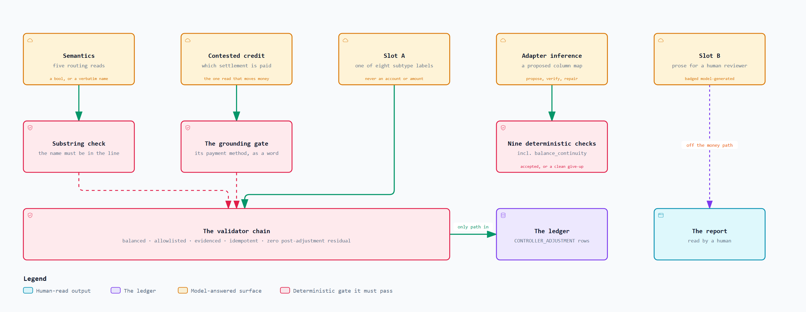
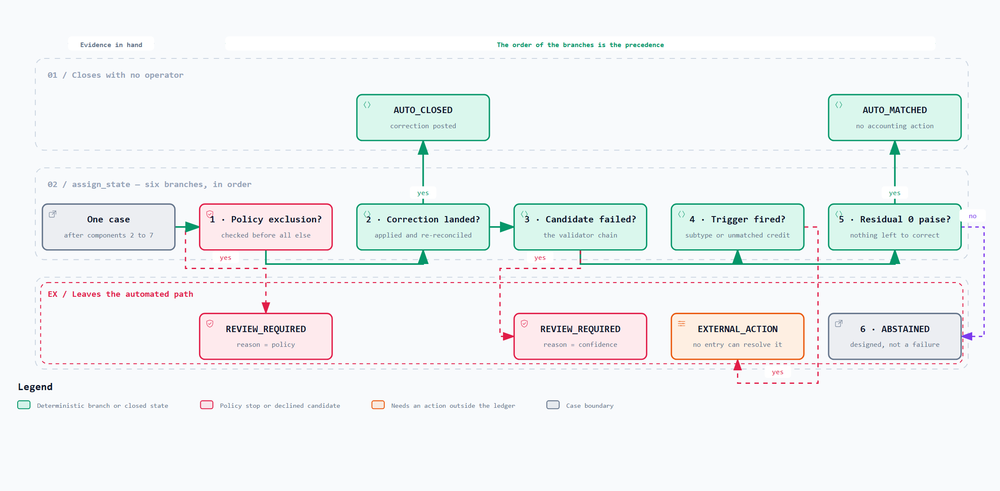

<div align="center">

# AI Settlement Close Controller

**The month-end settlement close, done by an agent that reads the evidence and lets deterministic code touch the money.**

Razorpay AI Buildathon 2026 · Track 4 (AI Finance Controller) · solo build

[](pyproject.toml)
[](tests/)
[](#the-results)
[](#the-results)
[](#every-model-call-is-on-the-record)

</div>

---

## The problem

At the end of every month a merchant on Razorpay has three records of the same money, and they disagree.

Their **accounting ledger** says what they booked. Razorpay's **settlement report** says what was actually paid out, net of fees, GST, refunds and chargebacks. Their **bank statement** says what landed. In the ordinary case the three line up and nobody looks. In the cases that matter they don't: a refund was issued but never posted, a fee was booked gross when the revenue was booked net, a chargeback moved through three lifecycle states in one period, a settlement is two days late and nobody knows whether it is late or lost.

Someone reconciles that by hand. The work is not hard, but it is unbounded. Every break has to be understood before it can be cleared, and the person doing it is the only thing standing between a wrong number and the general ledger.

Rules-based reconciliation already solves the easy 95%. Razorpay ships it. **This build is the layer above the rules: the exceptions a rule cannot resolve, where the evidence is ambiguous and someone has to decide.**

---

## What it does

Given a merchant's ledger export, a Razorpay settlement reconciliation file and a bank statement, the Controller works a batch of cases end to end and puts every one into exactly one of five terminal states:

| state | meaning |
|---|---|
| `AUTO_MATCHED` | clean; the three sources agree and nothing needs posting |
| `AUTO_CLOSED` | a correcting journal entry was derived, validated, posted, and the case re-reconciled to zero |
| `EXTERNAL_ACTION_REQUIRED` | categorized, evidenced, and blocked on someone outside the system |
| `REVIEW_REQUIRED` | a human decides |
| `ABSTAINED` | the evidence does not justify an automated decision |

On the committed 150-case batch: **80 close fully automatically**, every case the ground truth marks automatable, at a **false match rate of 0/150** and **auto-close precision of 50/50**. The other 70 are categorized, evidenced, and handed over with the required external action named.

**The design rule the whole build rests on:** the model may *classify* and may *write prose*. It may never originate an account, an amount, or a narration on the automated path. Every figure that reaches the ledger is computed by deterministic code the model never touches, and every correcting entry comes from a fixed allowlist of six templates. There is no seventh entry this system can post.

---

## Quickstart

```bash
uv sync
uv run reconcile
```

That reads the committed reference batch, runs the full pipeline, prints a summary, and writes `.run/report.html` and `.run/metrics.json`. No API key, no network call, no configuration.

```bash
uv run pytest                                              # 631 passed, 1 skipped
uv run reconcile --semantics llm --data-dir data/heldout_vocab \
                 --cache-path data/semantics_cache.json    # the model arm, offline
uv run python tools/infer_bank_profile.py data/unseen_bank/kotak_statement.csv
```

---

## The results

Seed 0, the shipped arms, nothing tuned in response to any of it.

| metric | value | target |
|---|---|---|
| `false_match_rate` | **0/150** | 0 |
| `auto_close_precision` | **50/50** | ≥ 0.98 |
| `auto_match_precision` | 30/30 | ≥ 0.95 |
| `state_prediction_accuracy` | 150/150 | 0.80 – 0.90 |
| `exception_subtype` precision / recall (macro, 7 subtypes) | 1.0000 / 1.0000 | 0.75–0.90 / 0.70–0.85 |
| `abstention_rate` | 17/150 = 0.1133 | 8 – 18% |
| `value_coverage` | 0.6246 | reported |

**Read the perfect scores as a statement about the batch, not about the system.** They are real and they reproduce, and they are close to meaningless on their own. The next two sections are the ones worth reading: the first says what the perfect scores are actually worth, and the second says where the model earns its place.

Throughput, six runs across two sessions on `Windows AMD64, Intel64 Family 6 Model 154 Stepping 4, Python 3.11.15`: 598–795 cases/s on the reference batch (150 cases, 7,111 raw records), 346–383 cases/s at scale (362 cases, 19,355 raw records). Full observed spread, not a best-of band.

---

## What the perfect scores are worth

A 0/150 false match rate invites exactly one question: *is the batch too easy?* Partly, yes, and the repository says so in two different ways rather than leaving it as a caveat.

**First, the benchmark is saturated, and that is a finding about the generator.** A keyword matcher with no model involved scores 1.0000 on state accuracy and both macro subtype metrics at seeds 0, 1, 2, 5, 7 and 11. Each anomaly family produces a distinct arithmetic signature, so evidence maps to label with no irreducible ambiguity for judgment to resolve. A perfect score on a task where perfection is arithmetic proves as little as one cherry-picked demo.

**Second, and this is the sharper one: every graded metric compares labels, not evidence.** `false_match_rate` asks whether the set of cases the pipeline called clean equals the set the answer key calls clean. A settlement that attached the *wrong* bank credit still lands in that set, provided the amount drove its residual to zero. The label is right and the evidence underneath it is wrong, and no rate denominated in cases can tell the difference.

That is not hypothetical. It is the shape of a real defect this build shipped and then found:

```
setl_AAA  tier=2  residual=0  lines=['bank_X']
setl_BBB  tier=2  residual=0  lines=['bank_X']     -> DOUBLE CLAIM
```

Two settlements reaching a clean state on one credit that can belong to at most one of them. It survived six seeds and the entire test suite, because amounts are drawn lognormally and an exact collision inside one window essentially never occurs. It was found by reading code, not by any measurement.

So `pipeline/attachment.py` measures the evidence instead of the label. Every credit the matcher attached to a settlement is classified once, by whether anything **in the record itself** ties that credit to that settlement:

| evidence | reference batch | what it means |
|---|---|---|
| names the UTR | 73 | the credit carries this settlement's UTR outright |
| names a UTR prefix | 15 | a truncated but unambiguous form of it |
| **amount and window only** | **10** | **nothing in the record identifies the settlement** |
| names another settlement | **0** | a false match no case-denominated metric can see |

The first two rows are the same comparison the matcher already made, so they corroborate themselves and are reported for the split, not as proof. The two rows that carry weight are the last two.

**Ten of ninety-eight is the honest number.** Those attachments cannot be confirmed *or* refuted from the committed records. The credit carries no reference token, and the only evidence is that the money and the dates line up. That is a real limit on what the perfect scores mean, and it is now a figure rather than a caveat.

**Zero contradictions is the assertion that can actually fail.** A tier-2 attachment is made on amount and date alone, so another settlement's UTR turning up in a credit attached here is a fact the matcher never consulted and cannot have arranged. `tests/test_attachment.py` builds that situation deliberately and asserts it is caught — because a check that cannot fire measures nothing.

---

## Where the model earns its place, and where it does not

Five surfaces touch a model. Each is separately switchable and separately measured, and the repository reports the measurement **in both directions** — including the two arms that say the model is not worth using.

| surface | what it decides | verdict |
|---|---|---|
| **Semantics** (5 routing reads) | does this narration name a counterparty; is this the gateway; a reversal; a bank charge; a tax position | **decisive under vocabulary drift, worthless without it** |
| **Contested-credit resolution** | which of two settlements a credit pays, or nothing | **returns Rs 7,323 of real bank credit** |
| **Slot A** (subtype classification) | one of eight exception subtypes | **measurably worse than the deterministic baseline** |
| **Slot B** (prose) | resolution text for a human reviewer | off the money path, ungraded |
| **Adapter inference** | a column map for a bank with no profile | accepted on attempt 1 for one bank, clean give-up for another |

### The model earns nothing on the batch this repository ships

Five of the pipeline's decision boundaries were literal-substring tests, and each separated the generator's own string pools with 100% hit and 0% miss. A shared *vocabulary* is not an import, so the import guard cannot see it; a seed does not vary a module constant, so a seed sweep cannot see it.

So `data/heldout_vocab/` was built: the same 150 cases, the same injected anomalies, the same answer key copied byte-for-byte — **only the bank's wording changed**, to real Indian bank-statement vocabulary sharing no literal with those lists.

| batch | `--semantics keyword` | `--semantics llm` |
|---|---|---|
| `data/reference/` | 150/150, macro P/R **1.0000** | 150/150, macro P/R **1.0000** |
| `data/heldout_vocab/` — same cases, same answer key, different words | **cannot complete a run** | 150/150, macro P/R **1.0000** |

On the shipped batch the model earns nothing and is correctly **not** the default. Change only the words, and the keyword arm does not degrade gracefully. It raises, because the gateway marker stops separating the gateway from a merchant and the case split collapses. The model arm recovers the batch completely.

`tests/test_heldout_vocabulary.py` pins **both** rows, asserting the failure as hard as the success. If someone later widens the keyword list, the keyword arm starts completing this batch, that test goes red, and the ablation has to be re-measured rather than silently becoming a comparison of two arms that now agree.

### The model returns Rs 7,323 of bank credit, and the gate that makes it safe

A settlement's credit can be matched by exact amount inside a two-day window, and that key is not unique to a settlement. When two settlements both claim one credit, no rule can say which owns it — and a human reads it in seconds, because the narration names the payment method the settlement actually settles.

On twelve hand-authored contested cases:

| arm | state accuracy | contests resolved | credit left unattached |
|---|---|---|---|
| `--semantics keyword` | 6/12 | 0 of 2 | Rs 12,693.20 |
| `--semantics llm` | 8/12 | **2 of 2** | Rs 5,370.20 |

Both arms cost **zero false matches**, and the model arm is strictly additive — it matched everything the keyword arm did. **Rs 7,323.00 moves from attached to nothing to attached to the settlement that owns it.**

**The part worth reading is what happened before the gate existed.** Measured first on a narration that names nothing (`"NEFT CR RAZORPAY SOFTWARE PVT LTD SETTLEMENT"`), the model answered a settlement id anyway. 5 of 6. A coin flip presented as an answer, and on this read a coin flip books real money against the wrong settlement.

The fix is not a better prompt. It is to stop trusting the answer and check the **justification**: a settlement may only win if one of its own payment methods appears as a word in the narration the model read. The model may point at evidence; it may not assert without it. An ungrounded answer is discarded rather than downgraded, so it costs exactly the abstention the deterministic path would have produced. **With the gate, 6 of 6**, and the undecidable settlements stay untouched.

There is a detail here worth stating plainly: the two credits the model wins are exactly the two with *no* reference token in the record. The model's value lands precisely where the record-level evidence runs out, which is why the grounding gate has to be the substitute witness.

### The model is worse than the baseline at the job it looks best suited for

`exception_subtype`, macro, seed 0:

| arm | precision | recall | state accuracy | LLM calls |
|---|---|---|---|---|
| `baseline` — triggers + keyword read | **1.0000** | **1.0000** | **150/150** | 0 |
| `hybrid` — model decides only the untriggered split | 0.9333 | 1.0000 | 143/150 | 16 |
| `llm` — model over all eight labels | 0.8012 | 0.8405 | 143/150 | 70 |

**Why it loses, stated plainly.** Six of the seven graded subtypes have a deterministic trigger, and the evidence bundle the model receives carries no UTR, no amount and no dispute flag, correctly, because handing it those would let it originate a figure. So the model cannot *check* six of the eight definitions it is asked to choose between; it pattern-matches narration text instead. The cost lands as false positives on cases whose ground truth is `ABSTAINED`: confident exceptions manufactured out of genuine ambiguity, which is the worst error direction in this domain.

Slot A stays in the repository as the comparator and as the honest record of a measured negative result.

**The lesson is the contrast, not either number: the same model is net-negative when asked to choose among labels it cannot verify, and decisive when asked a question it can.**

---

## Every model call is on the record

Every model call this repository makes is recorded, keyed by a SHA-256 of the exact prompt, and committed. That has three consequences:

1. **Anyone can audit what the model was asked and what it answered** — the prompts and completions are in the repository, not in a log on someone's laptop.
2. **Every ablation above re-runs from those records** with no API key, so a reviewer can reproduce the comparison rather than take the table on trust.
3. **`tests/test_reproduce.py` proves it for real**: a genuine `git clone` into a temp directory, a genuine `uv sync`, a genuine run with `FIREWORKS_API_KEY` stripped from the environment, asserting the resulting `metrics.json` is byte-identical to the committed one.

For a system that posts to a ledger, that is the difference between "the model decided" and "here is what the model was asked, what it answered, and what checked it." `--cache-mode refresh` is the only mode that calls the provider.

---

## How it is built

Twelve components, one direction of data flow, no cycles.

<picture>
  <source media="(prefers-color-scheme: dark)" srcset="assets/diagrams/architecture.dark.png">
  
</picture>

<sub>**Green** a deterministic pipeline stage · **amber** a model-touching arm, separately switchable and separately measured · **red** the validator, the only gate into the ledger · **purple** stored state · **teal** the reported output · **grey** the data boundary. Dashed edges are dependencies, not data flow.<br>Detail is small at README width — open full size: <a href="assets/diagrams/architecture.light.png">light</a> · <a href="assets/diagrams/architecture.dark.png">dark</a></sub>

| # | component | job | module |
|---|---|---|---|
| G | Generator | Seeded synthetic batches plus their answer key | `generator/` |
| S | Semantics | The six free-text reads, keyword arm and LLM arm | `pipeline/semantics.py` |
| 1 | Adapters | Declarative column map → canonical bank line; profile inference for an unseen bank | `pipeline/adapters/` |
| 2 | Case assembly | Recon lines grouped into settlement-anchored cases; residual bank lines into orphan cases | `pipeline/case_assembly.py` |
| 3 | Matcher | The four-tier cascade, T+2 window, integer-paise residual, cross-settlement contention | `pipeline/matcher.py` |
| 4 | Predicates | The six evidence tests plus the operational-exception triggers | `pipeline/predicates.py` |
| 5 | Classifier | Exception class and subtype (Slot A) | `pipeline/classifier.py` |
| 6 | Instantiator | Template → candidate entry; deterministic amount derivation | `pipeline/instantiator.py` |
| 7 | Validator | The full validation chain — the only gate into the ledger | `pipeline/validator.py` |
| 8 | Apply | Ledger write under an idempotency constraint, residual recheck, terminal state | `pipeline/apply.py` |
| P | Policy gate | Exclusions that keep a case off the auto-close path regardless of confidence | `pipeline/policy.py` |
| 9 | Reporter | Metric surface, confusion matrices, one self-contained HTML file | `pipeline/report.py` |
| A | Bank-line accounting | Every bank line in exactly one disposition, denominated in records not cases | `pipeline/bank_accounting.py` |

Two things the table cannot show and the picture can: **the generator never appears on the spine**, because the pipeline's entry point is a batch on disk and a static import guard makes any other channel a test failure; and **semantics is not a stage**, but a dependency seven components take, which is why it hangs off the spine rather than sitting on it.

<details>
<summary><b>Where the model is allowed to act, exactly</b></summary>

<picture>
  <source media="(prefers-color-scheme: dark)" srcset="assets/diagrams/permissions.dark.png">
  
</picture>

<sub>**Amber** a model-answered surface · **red** the deterministic gate it must pass · **purple** the ledger · **teal** the human-read output. Nothing reaches the ledger except through the validator chain, and no arrow carries an account, an amount, or a posted narration.<br>Open full size: <a href="assets/diagrams/permissions.light.png">light</a> · <a href="assets/diagrams/permissions.dark.png">dark</a></sub>

The semantics surface returns only a `bool` or a counterparty name **lifted verbatim out of text the bank wrote**, verified as a substring before it is trusted. Its answers route cases; they never price one. The LLM arm could return adversarial nonsense on every call without producing a wrong journal entry — it would produce wrong *routing*, which the metric surface measures and the validation chain still gates.

</details>

<details>
<summary><b>How one case reaches its state</b></summary>

<picture>
  <source media="(prefers-color-scheme: dark)" srcset="assets/diagrams/states.dark.png">
  
</picture>

<sub>Open full size: <a href="assets/diagrams/states.light.png">light</a> · <a href="assets/diagrams/states.dark.png">dark</a></sub>

`assign_state` is six branches in a fixed order, and that order *is* the precedence rule: the first branch a case satisfies decides its terminal state, so reordering them silently relabels cases. Two orderings are load-bearing:

- **A policy exclusion is evaluated before anything else**, regardless of model confidence and regardless of the fact that the entry would have validated.
- **A correction that landed outranks any subtype trigger the same case also fired**, because an operational exception means a discrepancy no journal entry can resolve.

</details>

<details>
<summary><b>Bank-line accounting: how Rs 12,693.20 went missing where no test could see it</b></summary>

Every graded metric is denominated in **cases**. That is the right unit for grading and it has one blind spot: a bank line that reaches no case is invisible to all of them. `data/contested/` shipped that way: Rs 12,693.20 of real bank credit in no case, no metric and no report. Four credits narrate the gateway, so orphan assembly never considered them; tier-2 demotion then dropped them from every settlement that had claimed them. Every individual decision was correct. The batch simply stopped adding up.

`pipeline/bank_accounting.py` closes that. It grades nothing — it is a **partition proof**. Every bank line lands in exactly one disposition, and `unaccounted` must always be empty:

| disposition | reference batch |
|---|---|
| `settlement_evidence` | 98 lines, Rs 20,68,915.10 |
| `orphan_evidence` | 28 lines, Rs 37,634.69 |
| `contested_unawarded` | 0 |
| `bank_charge` | 20 lines |
| `self_matched_reversal` | 12 lines, Rs 6,724.03 |
| `outbound_noise` | 18 lines |
| **`unaccounted`** | **0** |

176 lines in, 176 placed, asserted on all four committed batches. The dispositions are read off the pipeline's own decisions rather than re-derived, because a drifted second copy would report a clean partition over a batch that no longer has one.

</details>

<details>
<summary><b>The agentic surface: bank-profile inference</b></summary>

For a bank with no hand-written profile, `pipeline/adapters/inference.py` runs a bounded **propose → verify → repair** loop. The model proposes a column map under constrained decoding — its output space is column names and a date pattern, with no field for an amount or an account. Nine deterministic checks then run the real, unmodified parser over the real file. The strongest is `balance_continuity`: `balance[i] − balance[i−1] == deposit[i] − withdrawal[i]` in integer paise, which uses the statement's own running balance as an independent witness against a debit/credit swap. A failing check's exact text feeds the next prompt. Three attempts, then a clean give-up, never an exception.

**Measured.** `kotak_statement.csv` — six-row junk header, serial column, `DD/MM/YYYY` dates, comma-grouped amounts, separate withdrawal/deposit columns, is **accepted on attempt 1**: 12/12 rows parsed, with totals equal to the statement's own printed summary, so the parse is right rather than merely successful.

**A measured negative, kept as a test.** `yesbank_statement.csv` has one amount column plus a separate Dr/Cr flag. The profile schema has two money columns and no direction flag, so **no column map can express this file**. The model read the date shape correctly, the direction check rejected the mapping, the repair prompt did not converge because there is nothing to converge to, and the loop gave up cleanly at the budget. That is a schema limitation, not a model failure, and it is reported as one.

</details>

---

## Where this goes next

The measurements above map out the headroom fairly precisely, which is the useful thing about running ablations in both directions.

**The deterministic path is one vocabulary change from failing.** That is not a hypothetical; it is the held-out result. Keyword rules over bank narration work until the bank rewords its statement, a merchant switches acquirer, or a new payment method ships. Real bank feeds drift constantly; this generator's do not. The model arm is the only one that survives it, and the honest reading of the reference batch's 1.0000 is that it measures a world that does not change.

**Ten of ninety-eight attachments rest on no record-level evidence at all.** Today they are counted. The next step is to give the model the same job it already does well on contested credits — read the narration for a discriminator the rules cannot express — and gate it the same way. The contested result says what that is worth: two of two, zero false matches, and the wins landing exactly where the record evidence is absent.

**The grounding gate is the transferable idea, and it is currently one substring check.** "A settlement may only win if its payment method appears as a word in the narration" is the whole gate. It is unfakeable for the same reason the counterparty read is, and it is also crude: two settlements sharing a payment method would both pass it. Making that gate richer — more evidence types, a real notion of what counts as corroboration — is the highest-value work left, because it is the mechanism that lets a model touch money safely at all.

**What would change the conclusions.** A batch whose correct label is genuinely undecidable from structure alone is still unbuilt; the held-out batch varies *vocabulary*, not *structure*. Until that exists, the claim "the model is net-negative at subtype classification" is a claim about this generator, not about the task.

---

## Honest limits

- **Both ablation batches were designed knowing where the deterministic path would break.** The keyword lists and the match cascade both predate them, so neither is tuned to fail. But the *axes* were chosen deliberately. They show the mechanisms are real; they do not establish how often either occurs in a real merchant's bank feed.
- **The evaluation is synthetic, end to end.** Ground-truth labels and the records being graded come from one generator. It measures whether the pipeline recovers the injected intent; it does not establish that the injected intent resembles a real merchant's books.
- **The batch is deliberately anomaly-enriched** by roughly an order of magnitude against a real-world break rate in the low single digits, so `match_rate` is not comparable to any industry figure. Only 30 of 150 cases require no action at all.
- **The reference batch contains no irreducible ambiguity, so it cannot discriminate between arms.**
- **The T+2 window has no holiday calendar**, weekends only. In India a settlement crossing a festival cluster reads as overdue when it is not.
- **Adapter inference cannot express a single-amount-column-plus-direction-flag statement.** The loop gives up cleanly rather than guessing.

<details>
<summary><b>Seven more, in full</b></summary>

- **`assign_state` reads the books-versus-evidence residual, not the matcher's.** So a contested settlement with accrual-clean books is `AUTO_MATCHED` on residual alone regardless of match tier, and only a fired trigger moves it. Every contested case is therefore placed past its window so a trigger can fire; inside the window the batch would measure nothing. That coupling is a design smell the fixture exposed and did not fix.
- **The held-out-vocabulary batch is a rewrite of one seed, not an independent draw.** It shares the reference batch's arithmetic and case allocation exactly.
- **The LLM semantics arm falls back to the keyword arm on a strict-mode cache miss** rather than raising, and counts the miss. A run reports how much of it was model-answered instead of assuming all of it was.
- **Inferred profiles carry a caller-supplied bank tag**, because the canonical bank-line schema has a closed three-value enum. The model is never asked for it and no check depends on it.
- **No recognition-entry proposals.** `EXTERNAL_ACTION_REQUIRED` cases carry a categorized exception and a recommended next step, but never a proposed entry.
- **Orphan cases are unresolvable by construction** and cannot reach `AUTO_MATCHED` or `AUTO_CLOSED`; they are the majority of `EXTERNAL_ACTION_REQUIRED`'s population.
- **The review thresholds are provisional.** `abstention_rate` reads below its band on the Slot A arm, because Slot A's eight-value output space has no "insufficient evidence" option, so a forced choice becomes a confident one.

</details>

---

## What broke

[`FAILURES.md`](FAILURES.md) is the record: **twenty incidents**, each with what broke, how it was found, the root cause, and the guard that stops it recurring. It is the most useful document in this repository, and it is not a postmortem written afterwards: the mechanism that produced it was in place before there was any code to break.

Among them: a `UNIQUE` constraint that made `AUTO_CLOSED` arithmetically unreachable for all 50 cases; nine ground-truth labels no component could ever have reached; an adversarial pass that found this repository shipping, pinning and documenting the arm that measures *worst*; and Rs 12,693.20 of bank credit that went missing without moving a single metric.

Five mechanisms account for every one of them: a failing test; a checkpoint running real code against real storage for the first time; reading a rendered artifact instead of trusting an assertion; a deliberate adversarial pass over work already declared finished; and stopping to verify a claim before building on it. **Only the first is automatic, and it caught the fewest.**

---

## Reference

<details>
<summary><b>Glossary</b></summary>

| term | meaning |
|---|---|
| **case** | One unit of reconciliation work. A *settlement-anchored* case is every recon line sharing a settlement id; an *orphan* case is a residual bank line belonging to no settlement. The batch is 125 and 25. |
| **residual** | The unexplained difference on a case, in integer paise. Zero residual is what "reconciled" means here. |
| **paise** | The only money unit. 1 rupee = 100 paise, stored as `int`. There is no floating-point arithmetic anywhere on the money path. |
| **tier 0–3** | The matcher's cascade, strongest evidence first: **0** exact UTR, **1** UTR prefix, **2** exact amount inside the T+2 window, **3** no match. First hit wins. Tier 2's key is not unique to a settlement, which is what the contested-credit work is about. |
| **T+2 window** | A settlement is expected to reach the bank within two working days, weekends excluded, no holiday calendar. |
| **the six templates** | The entire allowlist of journal entries this system may post. `T-01` unposted gateway fee + GST where revenue was booked gross · `T-02` unposted refund · `T-03` the same fee + GST where revenue was booked net · `T-04` a premature bank debit with no matching credit · `T-05` an unposted settlement credit adjustment · `T-06` an unposted settlement debit adjustment. |
| **Slot A / Slot B** | The two named model surfaces: subtype classification (graded, not the default) and reviewer prose (ungraded, off the money path). |

</details>

<details>
<summary><b>Datasets</b></summary>

| dataset | what it is |
|---|---|
| `data/reference/` | The committed seed-0 batch: 150 cases (125 settlement-anchored, 25 orphan), 1,392 recon lines, 5,418 ledger entries, 176 bank lines. |
| `data/heldout_vocab/` | The same batch under a disjoint surface vocabulary. Rewritten by template, reference tokens preserved verbatim so the tier cascade sees identical tokens; answer key copied byte-for-byte. |
| `data/contested/` | Twelve hand-authored cases exercising tier-2 contention: two decidable pairs, two undecidable pairs, four uncontested controls. Reported separately, never merged. |
| `data/adversarial/` | Ten hand-authored cases targeting four evidence boundaries. 10/10 state and exception-class agreement. |
| `data/unseen_bank/` | Two bank exports with no hand-written profile. |
| seed 2 | The held-out batch, generated on demand, never inspected case by case. |

The answer key is emitted from the injection plan when each case is planted, never re-derived by inspecting the generated records — re-deriving would embed the pipeline's own matching logic into its own answer key.

</details>

<details>
<summary><b>Not in scope</b></summary>

- Not a general reconciliation or rules-based bookkeeping product. Razorpay already ships those. This is the exception-resolution layer *above* predefined rules.
- No web server, SPA, database UI, authentication, or live dashboard. The CLI is the product; the report is one static HTML file.
- No real merchant data, anywhere. Every record comes from one seeded synthetic generator, which the graded pipeline is structurally forbidden from importing.

</details>

<details>
<summary><b>Repository layout</b></summary>

```
├── README.md                   # this file
├── ARCHITECTURE.md             # component-level design notes
├── FAILURES.md                 # twenty incidents, and the guard for each
├── generator/                  # synthetic batches + answer key — separate entry point
├── pipeline/                   # the graded path — must never import generator/
│   ├── cli.py                  #   `uv run reconcile` — the one documented command
│   ├── semantics.py            #   the six free-text reads, both arms
│   ├── matcher.py              #   the four-tier cascade and tier-2 contention
│   ├── attachment.py           #   what each matched credit rests on
│   ├── bank_accounting.py      #   where every bank line went
│   ├── validator.py            #   the only gate into the ledger
│   └── adapters/inference.py   #   propose -> verify -> repair
├── tools/                      # the scripts that build the ablation batches
├── tests/                      # one file per component
└── data/                       # committed batches, prompt caches, pinned metrics
```

</details>
